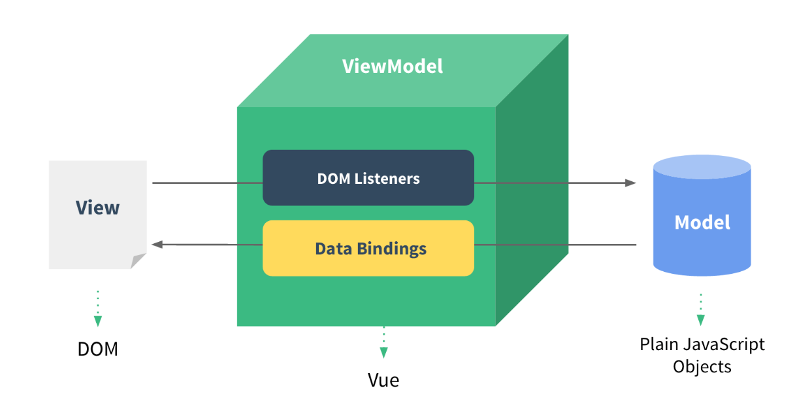
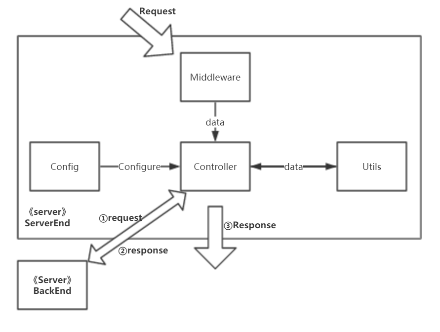
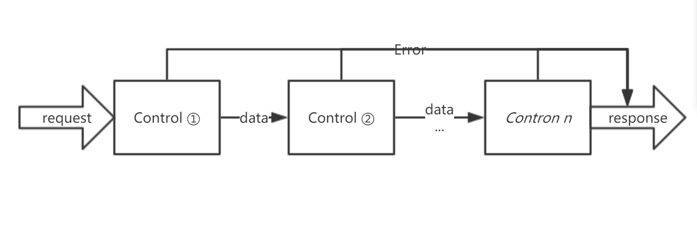

# 软件设计文档

|版本|日期|描述|作者|
|-|-|-|-|
|v0.1|2019年6月14日|初稿|BroImBro|
|v0.2|2019年6月25日|模板设计|快乐舔狗|
|v0.3|2019年6月26日|补充前端部分|Cynthia|
|v0.3.1|2019年6月26日|补充服务端部分|BroInBro|
|v0.4|2019年6月26日|补充服务端部分|Hairi|

> 声明：  
> **小组原创**：本项目(coinarrival)中全部仓库代码与文档为小组成员原创。  
> **使用项目**：本项目(coinarrival)同时作为**系统分析与设计**课程小组项目，项目中的所有小组成员均未改变。


# 软件整体架构


前端、服务端、后端分离，前端和服务端，服务端和后端之间采用RESTful API 完成交互。

其他详见 [软件架构](https://github.com/coinarrival/documents/blob/master/docs/design/softwareStructure.md)，[服务端API设计](https://github.com/coinarrival/documents/blob/master/docs/design/serverendAPI.md)，[后端API设计](https://github.com/coinarrival/documents/blob/master/docs/design/backendAPI.md)

# 前端

## 技术选型及理由

前端整体技术栈为：
Vue + Element-UI + webpack + axios

+ Vue：一套用于构建用户界面的渐进式框架，作为前端应用框架
+ Element-UI： 基于Vue的组件库，作为样式框架
+ webpack： 用于项目打包
+ axios：异步请求工具库

Vue：

+ 简洁的API和相对完整的文档对于开发者较友好
+ 轻量级且性能好
+ 数据驱动视图自动更新，可以让开发者更关注数据与逻辑，易于上手使用

Element-UI：

+ 风格简洁美观，免去了繁杂的美工设计工作
+ 可按需加载，只写入需要的样式即可，方便易用

webpack:

+ 可以将模块按照依赖和规则打包成符合生产环境部署的前端资源,实现项目的自动构建

axios:

+ 基于promise的工具库，处理异步请求部分的代码可读性较强
+ 轻量、高效、易用

## 架构设计

前端部分的主要文件结构：

```txt
├── index.html        // 主界面页面
├── package.json      // 记录项目依赖等配置信息
├── webpack.config.js // webpack打包的配置文件
├── src
    ├── App.vue
    ├── main.js
    ├── assets  // 存放所需的图标等静态资源
        ├── js
            ├── config.js
            ├── cookie.js // 用户登陆cookie的存取操作
        ... // 其他静态资源
    ├── router
        ├── index.js  // 页面跳转路由
    ├── views
        ├── home
            ├── home.vue // 
        ├── login
	        ├── login.vue // 登陆及注册页面
	    ├── main
	        ├── main.vue               // 包含下面五个页面作为组件，处理页面切换
	        ├── SurveyPublication.vue  // 发布问卷页面
	        ├── TaskList.vue           // 任务总览页面
	        ├── TaskPublication.vue    // 发布任务页面
	        ├── UserInfo.vue           // 用户信息页面
	        ├── UserWallet.vue         // 用户钱包页面
	        ├── TaskManager            
	            ├── TaskManager.vue        // 包含下面两个页面作为组件，处理页面切换
	            ├── TaskManagerAccept.vue  // 已接受的任务管理页面
	            ├── TaskManagerCreated.vue // 已发布的任务管理页面

```

## 模块划分

前端主要分为以下几个部分：

+ login：用户登陆及注册页面
+ TaskManager：任务管理页面（包含已接受任务的管理和以发布任务的管理页面）
+ main：主页面（包含任务总览，任务发布，问卷发布，用户钱包，用户信息五个页面）
+ router 控制页面间的跳转
+ assests 中存放前端的静态资源，其中的js文件夹下存放共用的工具函数

## 软件设计技术

### MVVM


Vue是基于MVVM架构的，因此前端部分可以应用了MVVM的设计，通过双向数据绑定使 View 和 Model 自动同步，不需要手动更新DOM，简化了开发者的工作。

### 模块化、组件化的构建方式

前端中多个页面之间采用组件化方式构建，将其他页面作为组件整合在一个主页面中，可以通过 tab 方便地切换组件页面。

# 服务端

## 技术选型及理由

服务端整体技术栈为：
koa2 + axios + mocha + chai + Docker

+ koa2：基于 JavaScript 的 Web 开发框架，利用生态圈内中间件开发服务端
+ koa-cors： 中间件负责处理跨域请求
+ koa-jwt： 中间件负责用户鉴权
+ jsonwebtoken： 中间件签发jwt
+ koa-body： 中间件负责解析请求数据
+ koa-router： 中间件负责路由管理
+ koa-static： 中间件负责静态资源发送
+ axios： 负责从后端请求和发送数据
+ mocha：基于 JavaScript 的测试框架
+ chai：基于 JavaScript 的断言库
+ Docker：免于环境配置困扰，快速部署运行

koa2：

+ 轻量、易于扩展
+ 生态圈中间件丰富，满足各种需求
+ 支持 ES6 语法，async 和 await 避免回调地狱

axios：

+ waiting

mocha + chai

+ 顺序执行测试，异常不中断
+ 测试报告中异常与测试样例相匹配
+ 支持异步函数测试
+ 断言语义化，测试代码可读性更高

## 架构设计

服务端部分的主要文件结构：

```txt
├─bin // 代码文件夹
│  ├─config // 项目配置文件夹
│  │  └─config.js   // 项目配置
│  ├─controllers // 路由文件夹
│  │  ├─acceptance.js
│  │  ├─accepted_tasks.js
│  │  ├─account_info.js
│  │  ├─balance.js
│  │  ├─created_tasks.js
│  │  ├─login.js
│  │  ├─registration.js
│  │  ├─task.js
│  │  └─tasks.js
│  ├─middleware // 自制中间件
│  │  ├─body.js         // 请求解析
│  │  ├─controller.js   // 路由注册
│  │  ├─login_check.js  // jwt 验证
│  │  └─static.js       // 静态资源服务
│  └─utils // 工具函数
│  │  ├─decodeToken.js      // 解析 jwt
│  │  ├─decodeUsername.js   // 解析用户名
│  │  ├─format.js           // 验证数据格式
│  │  └─logger.js           // log 函数
│  └─app.js // 项目入口文件
├─logs // 日志文件
│  ├─error      // 错误日志
│  └─response   // 请求日志
├─node_modules  // 第三方库
│  └─... modules 
├─resources // 静态资源文件夹
├─test // 测试代码文件夹
│  └─test.js // 测试代码
├─.travis.yml   // Travis CI 配置文件
├─development.js// 项目热更新入口
├─Dockerfile    // 项目 docker 镜像配置文件
├─docker-compose.yml    // 整合项目 docker 配置文件
└─package.json  // 项目描述和依赖关系
```

## 模块划分

服务端模块主要划分为：**配置模块，路由模块，中间件模块**和**工具函数模块**



**配置模块** 负责提供一些需要全局复用的配置信息（如后端的主机地址，服务端的地址等），通过将其模块化，我们可以更方便地对其管理和维护。**路由模块** 是处理请求路由的主要模块，其中包含了对于所有 API 的实现，错误处理等内容。**中间件模块** 提供了所有的对请求的非路由处理，比如静态文件服务托管，基于 JWT 的登陆验证，请求内容解析等。**工具类模块** 提供了复用程度较高的代码，方便我们对错误进行定位并维护代码的正确性。

## 软件设计技术

- 流程式控制

  对于服务端接收到请求，它的处理生命周期，通过流程管理。每一个流程，处理一部分内容，到最后处理完毕，返回结果；在处理流程内出现异常，则中断处理返回错误信息。

  

  ```javascript
  const app = new koa();

  // cors request
  app.use(cors({
    //...
  }));

  // verification
  app.use(
    koaJwt({
      //...
    })
  );

  // body parse
  app.use(body());

  // router
  app.use(router());

  // other control

  app.listen(config.port, () => {
    defaultLogger.trace(`Server running at port:${config.port}`);
  });
  ```

  在使用 Koa2 框架的同时，我们也引入了其推崇的流程控制设计模式。流程式控制使得一条请求的处理过程变得更加可控，从分析请求合法性，到请求解析，到处理数据，到最终返回，我们将每一个不同阶段的不同人物分配到不同的处理函数或中间件中，从而使得每一个过程只专注于该过程的工作，不必担心前序合法的校验。这样的设计大幅降低了代码耦合程度，提高了代码可读性和可维护性。

- 模块分离

  在开发过程中，我们将代码分模块(`config`，`controller`，`middleware`，`utils`)进行开发，不同模块处理不同工作，并且相互之间提供支持。模块分离使得代码耦合度降低，维护时可快速定位问题所在。同时，在 `utils` 内我们提供了复用程度高的代码，缩短了开发所需时间，并降低了维护时的错误定位难度。

  ```txt
  ├─bin // 代码文件夹
  │  ├─config // 项目配置
  │  ├─controllers // 路由
  │  ├─middleware // 中间件
  │  └─utils // 工具函数
  ```

# 后端

## 技术选型及理由

后端整体技术栈为：

Django + MySQL + Docker

+ Django： 作为后端应用框架
+ MySQL： 作为数据库框架
+ Docker: 分布式部署

Django：

MySQL:

Docker:


## 架构设计

后端部分的主要文件结构：

```txt

```

## 模块划分


## 软件设计技术

**TODO**: 给出具体设计在源代码中出现的位置，指明对应模块和代码