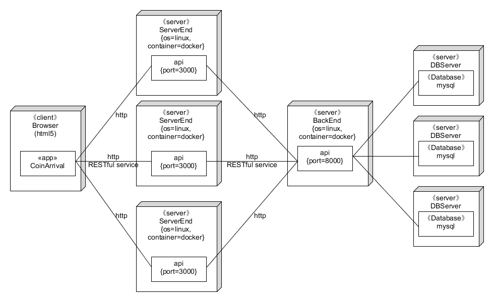
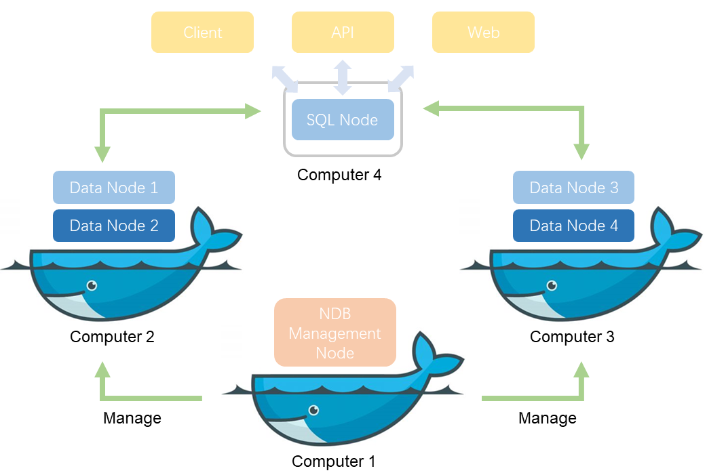

# 软件设计文档

|版本|日期|描述|作者|
|-|-|-|-|
|v0.1|2019年6月14日|初稿|BroImBro|
|v0.2|2019年6月25日|模板设计|快乐舔狗|
|v0.3|2019年6月26日|补充前端部分|Cynthia|
|v0.3.1|2019年6月26日|补充服务端部分|BroInBro|
|v0.4|2019年6月26日|补充服务端部分|BroInBro|
|v0.4.1|2019年6月26日|补充服务端部分|Hairi|
|v0.5|2019年6月26日|补充后端部分|张三丰|
|v0.5.1|2019年6月26日|补充货币系统|快乐舔狗|


> 声明：  
> **小组原创**：本项目(coinarrival)中全部仓库代码与文档为小组成员原创。  
> **使用项目**：本项目(coinarrival)同时作为**系统分析与设计**课程小组项目，项目中的所有小组成员均未改变。


# 软件整体架构



前端、服务端、后端分离，前端和服务端，服务端和后端之间采用RESTful API 完成交互。

其他详见 [软件架构](./softwareStructure.md)，[服务端API设计](./serverendAPI.md)，[后端API设计](./backendAPI.md)，[数据库设计](./userSystem.md)

# 前端

## 技术选型及理由

前端整体技术栈为：
Vue + Element-UI + webpack + axios

+ Vue：一套用于构建用户界面的渐进式框架，作为前端应用框架
+ Element-UI： 基于Vue的组件库，作为样式框架
+ webpack： 用于项目打包
+ axios：异步请求工具库

Vue：

+ 简洁的API和相对完整的文档对于开发者较友好
+ 轻量级且性能好
+ 数据驱动视图自动更新，可以让开发者更关注数据与逻辑，易于上手使用

Element-UI：

+ 风格简洁美观，免去了繁杂的美工设计工作
+ 可按需加载，只写入需要的样式即可，方便易用

webpack:

+ 可以将模块按照依赖和规则打包成符合生产环境部署的前端资源,实现项目的自动构建

axios:

+ 基于promise的工具库，处理异步请求部分的代码可读性较强
+ 轻量、高效、易用

## 架构设计

前端部分的主要文件结构：

```txt
├── index.html        // 主界面页面
├── package.json      // 记录项目依赖等配置信息
├── webpack.config.js // webpack打包的配置文件
├── src
    ├── App.vue
    ├── main.js
    ├── assets  // 存放所需的图标等静态资源
        ├── js
            ├── config.js
            ├── cookie.js // 用户登陆cookie的存取操作
        ... // 其他静态资源
    ├── router
        ├── index.js  // 页面跳转路由
    ├── views
        ├── home
            ├── home.vue // 
        ├── login
	        ├── login.vue // 登陆及注册页面
	    ├── main
	        ├── main.vue               // 包含下面五个页面作为组件，处理页面切换
	        ├── SurveyPublication.vue  // 发布问卷页面
	        ├── TaskList.vue           // 任务总览页面
	        ├── TaskPublication.vue    // 发布任务页面
	        ├── UserInfo.vue           // 用户信息页面
	        ├── UserWallet.vue         // 用户钱包页面
	        ├── TaskManager            
	            ├── TaskManager.vue        // 包含下面两个页面作为组件，处理页面切换
	            ├── TaskManagerAccept.vue  // 已接受的任务管理页面
	            ├── TaskManagerCreated.vue // 已发布的任务管理页面

```

## 模块划分

前端主要分为以下几个部分：

+ login：用户登陆及注册页面
+ TaskManager：任务管理页面（包含已接受任务的管理和以发布任务的管理页面）
+ main：主页面（包含任务总览，任务发布，问卷发布，用户钱包，用户信息五个页面）
+ router 控制页面间的跳转
+ assets 中存放前端的静态资源，其中的js文件夹下存放共用的工具函数

## 软件设计技术

### MVVM


Vue是基于MVVM架构的，因此前端部分可以应用了MVVM的设计，通过双向数据绑定使 View 和 Model 自动同步，不需要手动更新DOM，简化了开发者的工作。

### 模块化、组件化的构建方式

前端中多个页面之间采用组件化方式构建，将其他页面作为组件整合在一个主页面中，可以通过 tab 方便地切换组件页面。

# 服务端

## 技术选型及理由

服务端整体技术栈为：
koa2 + axios + mocha + chai + Docker

+ koa2：基于 JavaScript 的 Web 开发框架，利用生态圈内中间件开发服务端
+ koa-cors： 中间件负责处理跨域请求
+ koa-jwt： 中间件负责用户鉴权
+ jsonwebtoken： 中间件签发jwt
+ koa-body： 中间件负责解析请求数据
+ koa-router： 中间件负责路由管理
+ koa-static： 中间件负责静态资源发送
+ axios： 负责从后端请求和发送数据
+ mocha：基于 JavaScript 的测试框架
+ chai：基于 JavaScript 的断言库
+ Docker：免于环境配置困扰，快速部署运行

koa2：

+ 轻量、易于扩展
+ 生态圈中间件丰富，满足各种需求
+ 支持 ES6 语法，async 和 await 避免回调地狱

axios：

+ 相较于 jQuery，更专注于 AJAX 请求，避免引入冗余甚至冲突的代码
+ 轻量，高效
+ 支持 Promise，语法更规整易读

mocha + chai

+ 顺序执行测试，异常不中断
+ 测试报告中异常与测试样例相匹配
+ 支持异步函数测试
+ 断言语义化，测试代码可读性更高

## 架构设计

服务端部分的主要文件结构：

```txt
├─bin // 代码文件夹
│  ├─config // 项目配置文件夹
│  │  └─config.js   // 项目配置
│  ├─controllers // 路由文件夹
│  │  ├─acceptance.js // /acceptance 路由，处理对于任务接受的请求
│  │  ├─accepted_tasks.js // /accepted_tasks 路由，处理对于已接受任务的请求
│  │  ├─account_info.js // /account_info 路由，处理对于用户信息的请求
│  │  ├─balance.js // /balance 路由 处理对于账户余额的请求
│  │  ├─created_tasks.js // /created_tasks 路由，处理对于创建的任务的请求
│  │  ├─login.js // /login 路由，处理登陆请求
│  │  ├─registration.js // /registration 路由，处理注册请求
│  │  ├─task.js // /task 路由，处理对于任务实体的请求
│  │  └─tasks.js // /tasks 路由，处理对于任务实体的批量请求
│  ├─middleware // 自制中间件
│  │  ├─body.js         // 请求解析
│  │  ├─controller.js   // 路由注册
│  │  ├─login_check.js  // jwt 验证
│  │  └─static.js       // 静态资源服务
│  └─utils // 工具函数
│  │  ├─decodeToken.js      // 解析 jwt
│  │  ├─decodeUsername.js   // 解析用户名
│  │  ├─format.js           // 验证数据格式
│  │  └─logger.js           // log 函数
│  └─app.js // 项目入口文件
├─logs // 日志文件
│  ├─error      // 错误日志
│  └─response   // 请求日志
├─node_modules  // 第三方库
│  └─... modules 
├─resources // 静态资源文件夹
├─test // 测试代码文件夹
│  └─test.js // 测试代码
├─.travis.yml   // Travis CI 配置文件
├─development.js// 项目热更新入口
├─Dockerfile    // 项目 docker 镜像配置文件
├─docker-compose.yml    // 整合项目 docker 配置文件
└─package.json  // 项目描述和依赖关系
```

## 模块划分

服务端模块主要划分为：**配置模块，路由模块，中间件模块**和**工具函数模块**


**配置模块** 只有 `config.js` 文件，负责提供一些需要全局复用的配置信息（如后端的主机地址，服务端的地址等），通过将其模块化，我们可以更方便地对其管理和维护。**路由模块** 是处理请求路由的主要模块，其中包含了对于所有 API 的实现，错误处理等内容，每一个 JS 文件对应一个 API 的 endpoint。**中间件模块** 提供了所有的对请求的非路由处理，其中 `body.js` 提供了对于 POST 方法的 `requestBody` 解析功能，`controller.js` 负责对 controllers 文件夹下的路由模块进行注册。**工具类模块** 提供了复用程度较高的代码，方便我们对错误进行定位并维护代码的正确性，其中 `decodeToken.js` 用于解析 JWT，`decodeUsername.js` 调用 `decodeToken` 来解析当前用户的用户名，`format.js` 内存储了用于验证字段内容合法性的正则表达式，而 `logger` 则为整个端上项目提供了统一的日志记录接口。

## 软件设计技术

- **流程式控制**

  对于服务端接收到请求，它的处理生命周期，通过流程管理。每一个流程，处理一部分内容，到最后处理完毕，返回结果；在处理流程内出现异常，则中断处理返回错误信息。

  

  ```javascript
  const app = new koa();

  // cors request
  app.use(cors({
    //...
  }));

  // verification
  app.use(
    koaJwt({
      //...
    })
  );

  // body parse
  app.use(body());

  // router
  app.use(router());

  // other control

  app.listen(config.port, () => {
    defaultLogger.trace(`Server running at port:${config.port}`);
  });
  ```

  在使用 Koa2 框架的同时，我们也引入了其推崇的流程控制设计模式。流程式控制使得一条请求的处理过程变得更加可控，从分析请求合法性，到请求解析，到处理数据，到最终返回，我们将每一个不同阶段的不同人物分配到不同的处理函数或中间件中，从而使得每一个过程只专注于该过程的工作，不必担心前序合法的校验。这样的设计大幅降低了代码耦合程度，提高了代码可读性和可维护性。

- **模块分离**

  在开发过程中，我们将代码分模块(`config`，`controller`，`middleware`，`utils`)进行开发，不同模块处理不同工作，并且相互之间提供支持。模块分离使得代码耦合度降低，维护时可快速定位问题所在。同时，在 `utils` 内我们提供了复用程度高的代码，缩短了开发所需时间，并降低了维护时的错误定位难度。

  ```txt
  ├─bin // 代码文件夹
  │  ├─config // 项目配置
  │  ├─controllers // 路由
  │  ├─middleware // 中间件
  │  └─utils // 工具函数
  ```

  在 Koa2 的基础上，进一步地，我们将路由处理也提取到了单独文件中，这是通过 `controller` 中间件实现的：

  ```javascript
  /*
  * @file: middleware/controller.js
  * @line: 39-50
  */
  function addControllers(router) {
    let files = fs.readdirSync(PATH.resolve(__dirname, '../controllers'));
    let js_files = files.filter((f) => {
      return f.endsWith('.js');
    });

    for (let f of js_files) {
      defaultLogger.info(`[Import Controller] ${f}`);
      let mapping = require(PATH.resolve(__dirname, '../controllers/' + f));
      addMapping(router, mapping);
    }
  }
  ```

  当我们将其通过中间件的方式引用到 Koa2 对象后，它将会从 `controllers` 文件夹中自动遍历文件，并寻找他们 export 的对象，并转发到 `addMapping` 函数继续处理：

  ```javascript
  /*
  * @file: middleware/controller.js
  * @line: 12-30
  */
  function addMapping(router, mapping) {
    for (let url in mapping) {
      if (url.startsWith('GET ')) {
        let path = url.substring(4);
        router.get(path, mapping[url]);
        defaultLogger.info(`  [Register URL] GET ${path}`);
      } else if (url.startsWith('POST ')) {
        let path = url.substring(5);
        router.post(path, mapping[url]);
        defaultLogger.info(`  [Register URL] POST ${path}`);
      } else if (url.startsWith('DELETE ')) {
        let path = url.substring(7);
        router.delete(path, mapping[url]);
        defaultLogger.info(`  [Register URL] DELETE ${path}`);
      } else {
        defaultLogger.info(`  [Register URL] INVALID ${url}`);
      }
    }
  }
  ```

  在这里，`addMapping` 解析我们在 controllers 中暴露的字符串，并且将其添加为 Koa2 router 的路由处理函数。模块分离使得功能可以集中处理和维护的好处也在这里体现——我们可以很简单地就实现对于实时路由信息的打印，只需要在添加路由方法时 Log 即可。

- **日志监控**

  前面提到，我们对每一个请求采用流程式控制来管理。为了提高程序维护性，我们对处理流程加入日志管理。我们设定每天生成新的日志文件，日志文件通过日期命名来区分。在每一个控制流程内，提供日志输出：正确处理的请求，我们写入 `response` 日志中；异常抛出，则写入 `error` 日志中。每当服务端产生错误或者返回错误数据，根据日志，可以快速定位异常点。

  

  示例日志如下：

  - error

    ```log
    [2019-06-25T23:44:30.687] [ERROR] errLogger - POST /account_info: Unknown backend error
    ```
  - correct

    ```
    [2019-06-25T20:16:43.877] [INFO] resLogger - GET /task: Success for taskID 1
    ```

  同时，日志输出是一个可复用的模块，所以我们依据 `log4js` 库，定制了我们的 `logger` 工具函数。它提供三种输出方式且只响应预设的优先级信息。只有输出信息达到相应的优先级等级，才会被输出。优先级等级从低到高包含：`tracert`，`info`，`debug`，`error`，`fatal`五个等级。在编码时，针对不同信息，可以标记信息输出的等级。三个 `logger` 属于 `log4js` 类且设置如下：
  
  - defaultLogger，输出到控制台，响应所有等级信息
  - errorLogger，输出到 error 日志，响应 `error` 及以上等级信息
  - responseLogger，输出到 response 日志，响应 `info` 及以上等级信息

  **在实际测试中，日志帮助定位问题提供了很大的帮助**，起初加入日志设计，是一个很明智的决定。
  
  具体 `logger` 编码实现如下：

  ```javascript
  const log4js = require('log4js');
  const path = require('path');

  // log file base path
  const LOG_PATH = path.resolve(__dirname, '../../logs');

  // error log file path
  const ERROR_LOG_DIR = '/error';
  const ERROR_LOG_FILE = 'error';
  const ERROR_LOG_PATH = `${LOG_PATH}${ERROR_LOG_DIR}/${ERROR_LOG_FILE}`;

  // response log file path
  const RESPONSE_LOG_DIR = '/response';
  const RESPONSE_LOG_FILE = 'response';
  const RESPONSE_LOG_PATH = `${LOG_PATH}${RESPONSE_LOG_DIR}/${RESPONSE_LOG_FILE}`;

  log4js.configure({
    appenders: {
      'console': {
        'type': 'console'
      },
      'errLogger': {
        type: 'dateFile',
        path: ERROR_LOG_DIR,
        filename: ERROR_LOG_PATH,
        pattern: '-yyyy-MM-dd.log',
        alwaysIncludePattern: true,
        encoding: 'utf-8',
        maxLogSize: 1000
      },
      'resLogger': {
        type: 'dateFile',
        path: RESPONSE_LOG_DIR,
        filename: RESPONSE_LOG_PATH,
        pattern: '-yyyy-MM-dd.log',
        alwaysIncludePattern: true,
        encoding: 'utf-8',
        maxLogSize: 1000
      }
    },
    categories: {
      'default': {
        appenders: ['console'],
        level: 'all'
      },
      'errLogger': {
        appenders: ['errLogger'],
        level: 'error'
      },
      'resLogger': {
        appenders: ['resLogger'],
        level: 'info'
      }
    },
    baseLogPath: LOG_PATH
  });

  module.exports = function (loggerName) {
    return log4js.getLogger(loggerName);
  };
  ```

# 后端

## 技术选型及理由

后端整体技术栈为：

Django + MySQL + Docker + MySQL-Cluster

Django：

- 用于创建模型的对象关系映射
- 为最终用户设计的完美管理界面
- 一流的 URL 设计
- 设计者友好的模板语言
- 缓存系统


MySQL:

- 支持多线程，充分利用CPU资源
- 优化的SQL查询算法，有效地提高查询速度
- 支持大型的数据库。可以处理拥有上千万条记录的大型数据库
- 复制全局事务标识，可支持自我修复式集群
- 复制无崩溃从机，可提高可用性
- 复制多线程从机，可提高性能


MySQL-Cluster:

 - MySQL Cluster构建于NDB存储引擎之上，提供高度可伸缩、实时、符合ACID的事务数据库，结合了99.999%的可用性和开放源码的低TCO
 - MySQL Cluster是围绕分布式、多主、服务架构设计的，所以没有单点故障，它在商品硬件上横向扩展，以提供通过SQL和NoSQL接口访问的读写密集型工作负载


货币系统整体技术栈为： 


Go-Ethereum + Truffle

 - Go-Ethereum：一个基于Go实现的支持智能合约功能的区块链平台，提供去中心化的以太虚拟机来处理点对点之间的合约
 - Truffle：为以太坊提供开发、测试及部署的框架


Go-Ethereum：

 - 支持图灵完备的编程语言，可用来编写智能合约
 - 比较起其他的区块链平台，成熟易用，较为成熟
 - 作为多种产品和服务的平台，为系统提供强大的生态系统


Truffle：

 - 内置智能合约编译，链接，部署和二进制文件的管理
 - 针对快速迭代开发的自动化合约测试
 - 可脚本化，可扩展的部署与迁移
 - 与合约直接通信的交互控制台


## 架构设计

后端部分的主要文件结构：

```txt
├─BackEnd
│  │  Dockerfile // 项目 docker 镜像配置文件
│  │  requirements.txt // 项目依赖
│  │  start.sh // 启动脚本
│  │  
│  ├─BackEnd
│  │  │  manage.py // 管理文件
│  │  │  
│  │  ├─accept_task_info // 管理接受任务的应用
│  │  │  │  admin.py // 后台管理
│  │  │  │  apps.py
│  │  │  │  crypto.py // 加密控件
│  │  │  │  models.py // 数据模型
│  │  │  │  tests.py // 测试文件
│  │  │  │  urls.py // 路由
│  │  │  │  views.py // 交互逻辑函数
│  │  │          
│  │  ├─account_info // 管理账户信息
│  │  │  │  admin.py // 后台管理
│  │  │  │  apps.py
│  │  │  │  crypto.py // 加密控件
│  │  │  │  models.py // 数据模型
│  │  │  │  tests.py // 测试文件
│  │  │  │  urls.py // 路由
│  │  │  │  views.py // 交互逻辑函数
│  │  │          
│  │  ├─BackEnd
│  │  │  │  settings.py // 配置文件
│  │  │  │  urls.py // 路由
│  │  │  │  wsgi.py
│  │  │          
│  │  ├─task_info // 任务管理
│  │  │  │  admin.py // 后台管理
│  │  │  │  apps.py
│  │  │  │  crypto.py // 加密控件
│  │  │  │  models.py // 数据模型
│  │  │  │  tests.py // 测试文件
│  │  │  │  urls.py // 路由
│  │  │  │  views.py // 交互逻辑函数
│  │  │          
│  │  └─wallet_info // 钱包管理
│  │     │  admin.py // 后台管理
│  │     │  apps.py
│  │     │  crypto.py // 加密控件
│  │     │  models.py // 数据模型
│  │     │  tests.py // 测试文件
│  │     │  urls.py // 路由
│  │     │  views.py // 交互逻辑函数
│  │              
│  │  ├─currency_system // 货币系统代码文件夹
│  │  │  ├─contracts // 项目配置文件夹
│  │  │  │  ├─CoinArrivalCoin.sol // 货币智能合约
│  │  │  │  ├─Migrations.sol      // 迁移智能合约
│  │  │  │  └─SafeMath.sol        // 数学运算库
│  │  │  ├─migrations // 迁移部署脚本文件夹
│  │  │  │  ├─1_initial_migration.js  // 部署初始化
│  │  │  │  └─2_deploy_contracts.js   // 智能合约的部署及链接
│  │  │  ├─test // 测试代码文件夹
│  │  │  ├─truffle-config.js // Truffle 配置文件 1
│  │  │  └─truffle-box.json  // Truffle 配置文件 2
│  │  │       
│  └─design
│          model.uxf // 数据库设计文件
```

## 模块划分

后端主要分为路由模块、逻辑处理模块、模型交互模块、安全模块、后台管理模块、分布式数据库模块、区块链货币服务模块

- **路由模块** 负责将服务端不同的请求导向
- **逻辑处理模块** 负责解析服务端请求，获取和处理数据库数据
- **模型交互模块** 负责与数据库对接
- **安全模块** 以中间件的形式，为数据提供保密性、完整性的保障，且不需要修改其它代码，低耦合
- **后台管理模块** 方便后台人员以超级用户的方式修改、查看数据
- **分布式数据库模块** 采用负载均衡实现的数据库模块，鲁棒性好，且易于管理
- **区块链货币服务模块** 去中心化的货币系统，利用智能合约实现安全稳定的服务

## 软件设计技术

后端采用MVT架构设计


MVT是Model-View-Template的缩写

Django框架接收了用户请求和参数后，再通过正则表达式匹配URL，转发给对应视图进行处理。视图调用M处理数据，再调用T返回数据给服务端

- M表示model，负责与数据库交互
  - 对应与四个子应用的model.py，定义了数据结构，例如用户管理子应用的model
```python
class User(models.Model):
    username = models.CharField(max_length=100, unique=True)
    gender = models.CharField(max_length=30, null=True)
    email = models.CharField(max_length=50, unique=True)
    phone = models.CharField(max_length=15, unique=True)
    school = models.CharField(max_length=50, null=True)
    major = models.CharField(max_length=30, null=True)
    age = models.IntegerField(null=True)
    role = models.CharField(max_length=30, null=True)
    studentID = models.CharField(max_length=30, null=True)
    teacherID = models.CharField(max_length=30, null=True)
    grade = models.CharField(max_length=30, null=True)
    password = models.CharField(max_length=30)
    avatar = models.CharField(max_length=300, null=True)
```
- V表示view，是核心，负责接收请求、获取数据、返回结果
  - 对应于四个子应用的view.py，负责处理解析服务端的请求，执行相应的数据获取和处理，例如返回参与任务情况的部分逻辑
```python
def operate_acceptance(request):
    if request.method == 'GET':
        try:# 解析服务端请求
            page = int(decrypt(request.GET['page']))
            tusername = decrypt(request.GET['issuer'])
            ttaskID = decrypt(request.GET['taskID'])
        except:
            return dealResponse(400)
        try: # 获取数据
            fuser = User.objects.get(username=tusername)
            ttask = Task.objects.get(taskID=ttaskID)
        except(User.DoesNotExist, Task.DoesNotExist):
            return dealResponse(404)
        if fuser != ttask.issuer:
            return dealResponse(401)
        # 计算和处理数据
        result = AcceptTask.objects.filter(task=ttask)
        max_pages = math.ceil(float(len(result)) / MAX_PAGE_ITEMS)
        if page > max_pages or page <= 0:
            return dealResponse(416, {"data": {"max_pages": max_pages}})
        page = page - 1
        resp = {"data" : {
                "records" : [], 
                "max_pages" : max_pages
            }
        }
        startid = page * MAX_PAGE_ITEMS
        endid = min(len(result), (page+1)*MAX_PAGE_ITEMS)
# ...
```
- T表示template，负责将数据呈现给服务端
  - 由于格式简单，包含在四个子应用中的view.py文件，例如呈现任务列表的逻辑
```python
# 返回指定格式
for i in range(startid, endid):
    oner =  {
    "userID": result[i].user.id,
    "isFinished": result[i].isFinished, 
    "answer":result[i].answer
}
    resp['data']['records'].append(oner)
```

在安全方面，采用AES加密和消息验证码，能有效保证数据的保密性、完整性，避免信道窃听、重放攻击的实施，例如crypto.py中的AES加密

```python
def _pad(s): return s + (AES.block_size - len(s) % AES.block_size) * chr(AES.block_size - len(s) % AES.block_size) 
def _cipher():
    key = settings.SECRET_KEY
    # return AES.new(key=key, mode=AES.MODE_CBC, IV=iv)
    return AES.new(key=key[:32], mode=AES.MODE_CBC, IV=key[:16])
 
def encrypt(data):
    if settings.ENABLE_CRYPTO:
        return _cipher().encrypt(_pad(data))
    return data
    
def decrypt(data):
    if settings.ENABLE_CRYPTO:
        return _cipher().decrypt(data)
    return data
```

货币系统采用 ERC20 代币标准， RRC20 是以太坊上一种用以评判该代币是否满足一定的安全性和可用性的通用标准。

满足 ERC20 代币标准的智能合约必须包含以下四个功能：
 - tranfer：自己本地转账
 - approve：批准别人使用自己的钱（可多次使用）
 - transferFrom：与approve结合使用
 - allowance：返回批准使用钱的余额

由于智能合约中的 bug （如计算溢出等问题）会导致不可逆转的结果（盗用财产，空手套白狼等），所以我们编写了安全计算库 SafeMath，里面利用一些可忽略的花销来实现了相对安全的 uint256 类型数据的货币转移四则运算功能。

```js
// 乘法
function mul(uint256 a, uint256 b) internal pure returns (uint256) {
    if (a == 0) {
        return 0;
    }
    uint256 c = a * b;
    require(c / a == b);

    return c;
}

// 除法
function div(uint256 a, uint256 b) internal pure returns (uint256) {
    require(b > 0);
    uint256 c = a / b;

    return c;
}

// 减法
function sub(uint256 a, uint256 b) internal pure returns (uint256) {
    require(b <= a);
    uint256 c = a - b;

    return c;
}

// 加法
function add(uint256 a, uint256 b) internal pure returns (uint256) {
    uint256 c = a + b;
    require(c >= a);

    return c;
}
```

CoinArrivalCoin 货币系统的实现，有以下的设计：
 - 总供量：1000000000
 - 名字：CoinArrivalCoin
 - 符号：CAC
 - 精确小数位：0（整数）

ERC20 标准中的功能实现如下所示：

```js
contract Coin is StandardToken {
 
  // 余额
	mapping (address => uint256) public balanceOf;

	mapping (address => mapping (address => uint256)) internal allowed;
	
  // 构造器
	constructor() public {
        totalSupply = 1000000000;
        name = "CoinArrivalCoin";
        symbol = "CAC";
        decimals = 0;
        balanceOf[msg.sender] = totalSupply;
    }
 
    // 自己本地转账
    function transfer(address to, uint256 value) public returns (bool success) {
		require(to != address(0));
		require(value <= balanceOf[msg.sender]);
 
        balanceOf[msg.sender] = sub(balanceOf[msg.sender], value);
        balanceOf[to] = add(balanceOf[to], value);
        emit Transfer(msg.sender, to, value);
        return true;
    }

    // 批准别人使用自己的钱（可多次使用）
    function approve(address spender, uint256 value) public returns (bool success) {
        require(spender != address(0));

        allowed[msg.sender][spender] = value;
        emit Approval(msg.sender, spender, value);
        return true;
    }
 
    // 与approve结合使用
    function transferFrom(address from, address to, uint256 value) public returns (bool success) {
		require(to != address(0));
        require(value <= balanceOf[from]);
        require(value <= allowed[from][msg.sender]);
 
        balanceOf[from] = sub(balanceOf[from], value);
        balanceOf[to] = add(balanceOf[to], value);
        allowed[from][msg.sender] = sub(allowed[from][msg.sender], value);

        emit Transfer(from, to, value);

        return true;
    }
 
    // 返回批准使用钱的余额
    function allowance(address _owner, address spender) public view returns (uint256 remaining) {
      return allowed[_owner][spender];
    }
 
}
```

分布式存储使用 的 Docker-Mysql-Cluster 框架



各部分的功能如下所示：
 - SQL node：使用 NDBCLUSTER 存储引擎的传统 MySQL 服务器。
 - NDB Management node：管理NDB集群中的其他节点，执行提供配置数据、启动和停止节点以及运行备份等功能。
 - Data node：存储集群数据，我们采取4个副本来提供冗余，从而获得高可用性。采取两个服务器，每个服务器有2个副本。