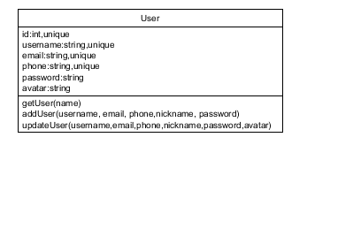

# 用户系统数据库设计

|版本|日期|描述|作者|
|:-:|:-:|:-:|:-:|
|v0.1|2019年5月24日|初稿|BroInBro|
|v0.2|2019年6月12日|增加具体实现|张三丰|




```mysql
CREATE TABLE `account_info_account_info` (`id` integer AUTO_INCREMENT NOT NULL PRIMARY KEY, `username` varchar(200) NOT NULL UNIQUE, `email` varchar(200) NOT NULL UNIQUE, `phone` varchar(200) NOT NULL UNIQUE, `password` varchar(200) NOT NULL, `avatar` varchar(200) NOT NULL);
COMMIT;
```