# Manual

|版本|日期|描述|作者|
|-|-|-|-|
|v0.1|2019年6月14日|初稿|BroImBro|
|v0.2|2019年6月26日|终稿|无情闲鱼|

## 一、引言  

### 1.1 编写目的  

本文档是币达平台针对用户所编写的使用说明手册，在本文档中将进行详细而具体的操作描述，通过该文档读者可以了解该系统的功能。

### 1.2 背景  

项目单位：币达软件开发小组

## 二、软件概述

### 2.1 目标

使用户能够轻松掌握本软件的使用，能够发布任务、领取任务，通过这样的方式挣闲钱。

### 2.2 功能概述

系统注册登录；币达任务浏览；发布一般任务；发布问卷；管理任务；管理钱包；管理个人信息。

## 三、运行环境

支持 MySQL 5.7, python 3， node(>=v9.0), npm(>=v6.0)，以及支持web服务。

## 四、使用说明

### 4.1 安装与部署

  详见 [安装部署声明](./productionSpecification/installation.md)

### 4.2 注册与登录  
  进入到币达的导航页，可以进行用户注册或登录。  

  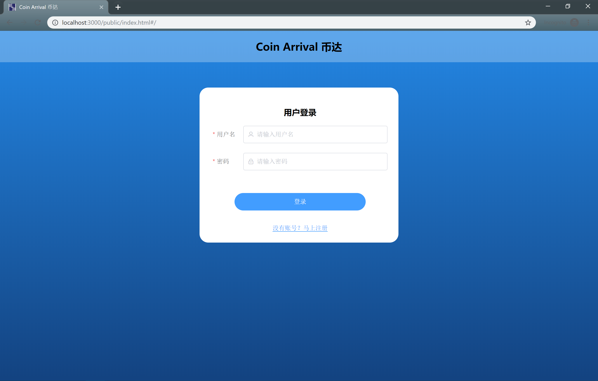  

  如果没有账号，可以先进行注册。填写好**用户名、密码（8-20位）、邮箱、电话号码以及职业**等信息，点击注册即可。  

  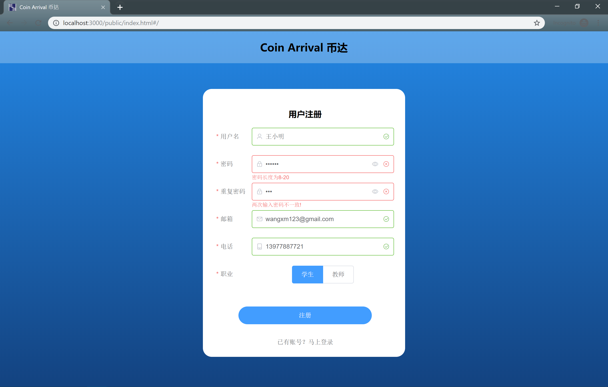  
  注册成功后将自动返回登录页面，填写用户名以及密码即可登录。  

  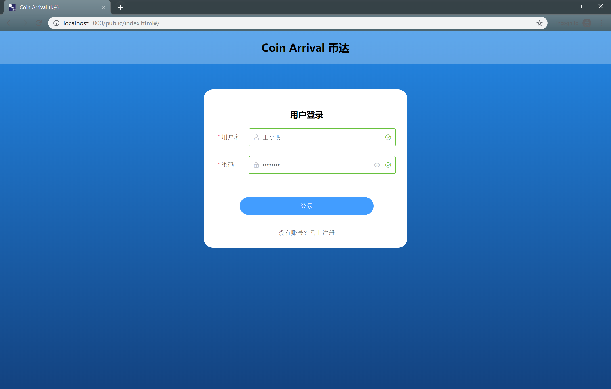  

### 4.3 主页  

  登录成功后，进入到主页，点击不同的标签页可以查看不同的信息。

#### (1) 币达任务总览  

  在币达任务总览标签页，可以浏览当前所有的币达任务，任务分为普通任务以及问卷任务两类，点击任务可以查看任务详情。另外，可以通过选择类型、任务报酬升序/降序、期限升序/降序、任务状态（可承接/已过期）进行任务的筛选。

  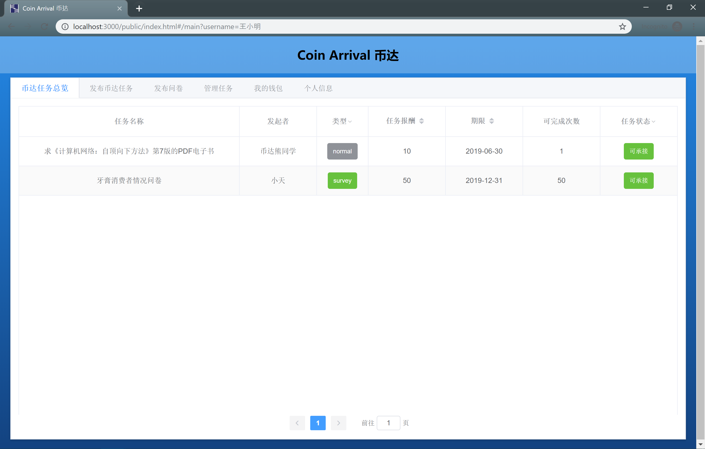

  点击表单中的一项任务，可以查看任务详情。如果对**可承接任务**的任务内容以及报酬感到满意，可以承接该任务。  

  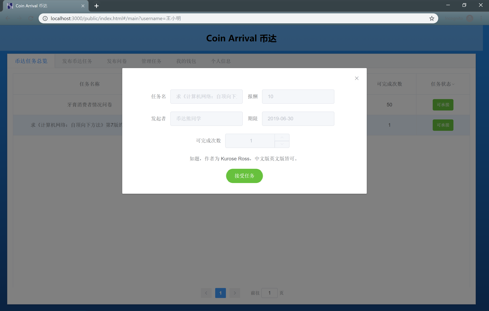

#### (2) 发布币达任务  

  当然，用户也可以自己发布任务。在**发布币达任务**标签页，用户可以发起普通任务。发起任务时，要确保账户余额足够。  

  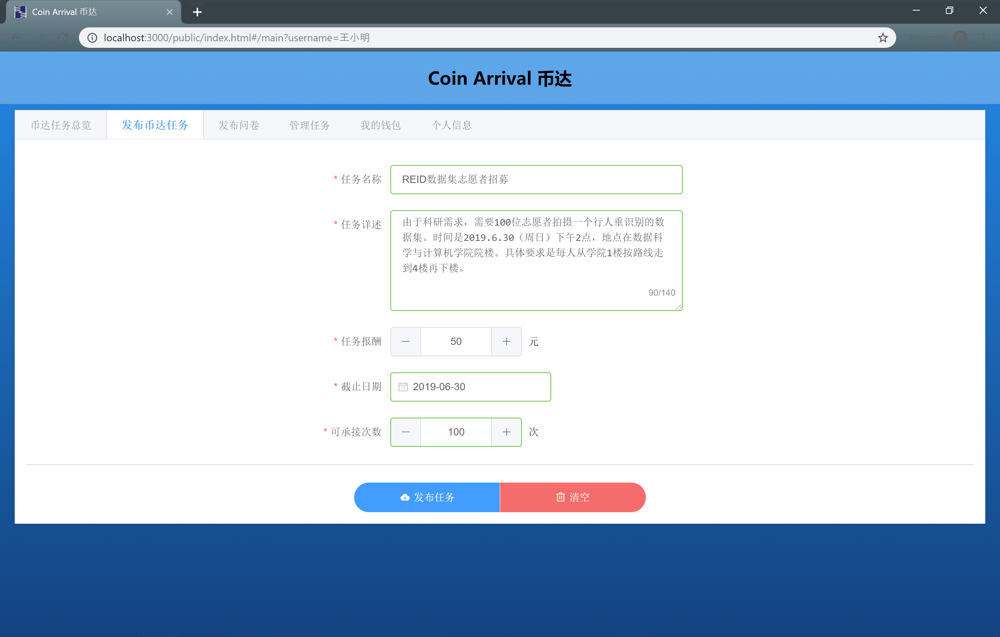

#### (3) 发布问卷  

  除了普通任务，用户也可以在**发布问卷**标签页中发布问卷。  

  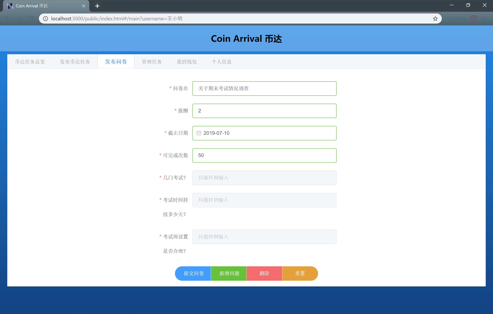

#### (4) 管理任务  

  在**管理任务**标签页，用户可以查看自己发起的以及接受了的任务情况，可以查看详情或删除。  

  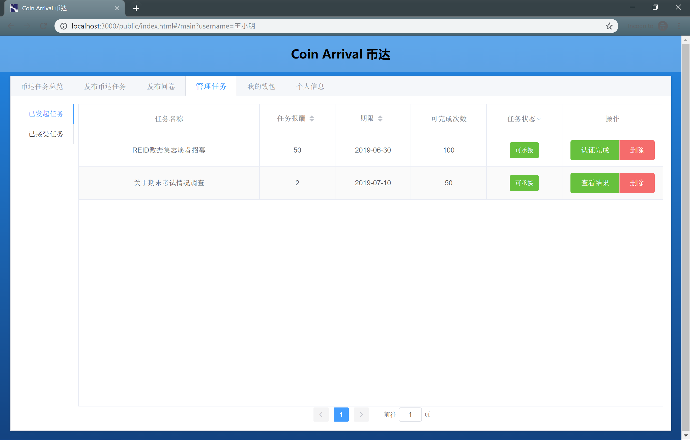

  对于普通任务，点击“认证完成”，可以看到承接者的信息。当用户通过线下验证或其他验证方法确认后，可以完成某位参与者的认证。认证完成后将会发放报酬。

  

  对于问卷，点击查看结果，可以看到所有参与问卷调查人员的问卷，点击下载结果，可以将问卷结果下载到本地（目前支持json格式）。

  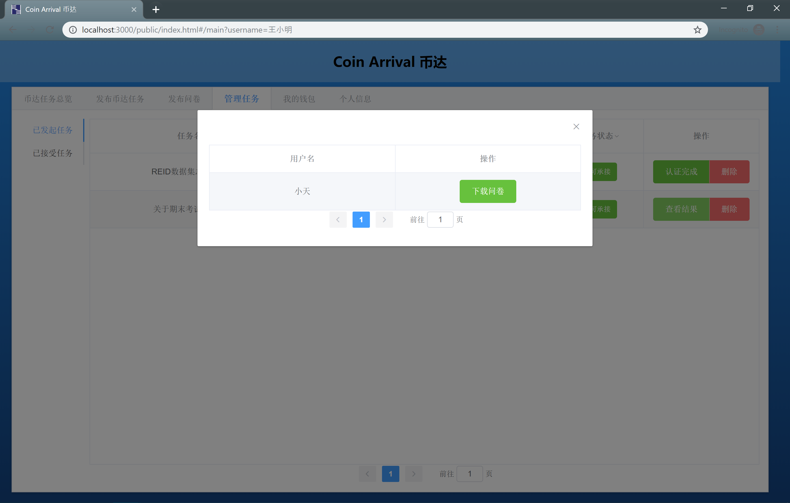

  在页面左边，点击“已承接任务”，可以查看自己已承接的任务。如果自觉不力，可以选择放弃任务。

  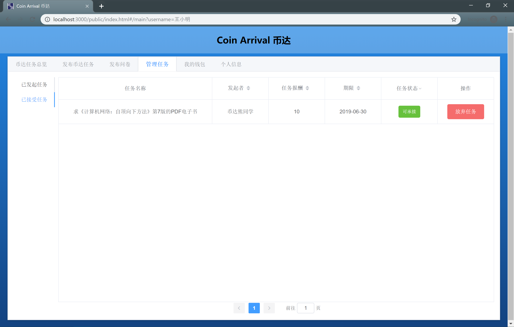

#### (5) 我的钱包

  在我的钱包页面，可以查看账户余额，并可以选择充值或者提现。
  
  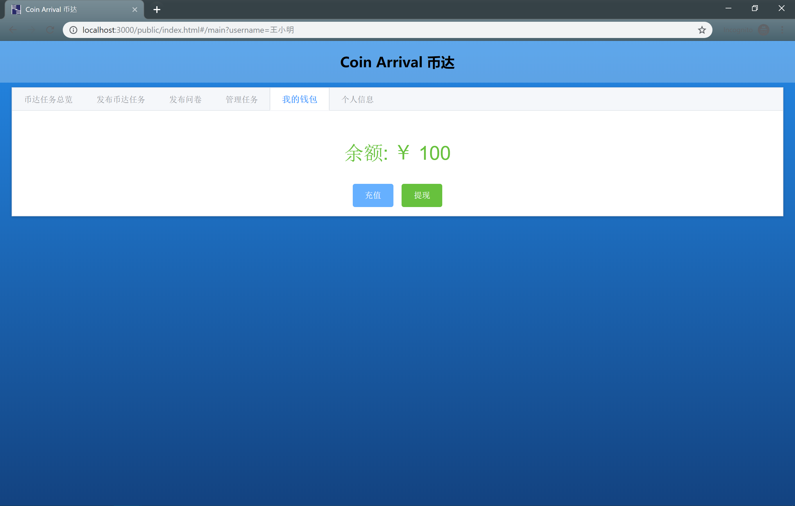

#### (6) 个人信息

  在**个人信息**页面，可以进一步地完善个人信息，包括头像、年龄、性别等信息。  

  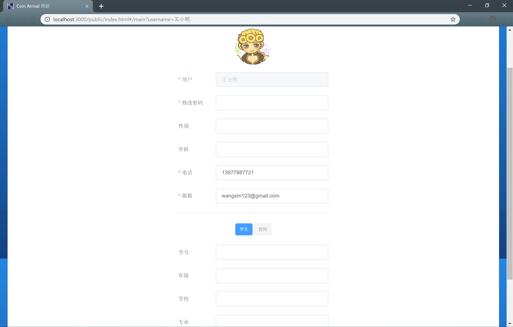

