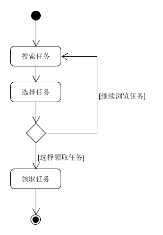
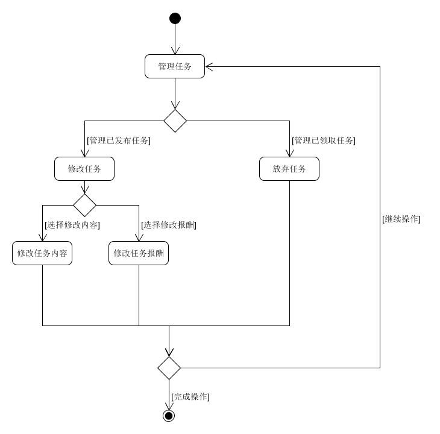

# Usecases And Activity Diagram

|版本|日期|描述|作者|
|:-:|:-:|:-:|:-:|
|v0.1|2019年5月6日|登陆注册泳道图|全员|
|v0.2|2019年5月22日|登陆注册用例描述|BroInBro|
|v0.3|2019年6月16日|搜索/管理任务，管理币达币活动图|全员|
|v0.4|2019年6月16日|搜索/管理任务，管理币达币用例描述|BroInBro|
|v0.5|2019年6月23日|正式用例描述|Cynthia|

## 正式用例 Use Case 1 发布任务

**范围：** 币达挣闲钱系统

**级别：** 用户目标

**主要参与者：** 需要发布任务的用户

**涉众及其关注点：** 

- 需要发布任务的用户：希望通过支付一定报酬方便地收集问卷或完成需要的跑腿、志愿者招募等任务。

- 需要赚闲钱的用户：希望清晰地看到所有可以接受的任务，并通过接受任务赚取报酬。

**前置条件：** 

用户必须已注册并成功登陆，已注册用户必须通过认证确保信息真实性，发起任务的用户币达币余额不能为零。

**成功保证（或后置条件）：**

币达任务总览中可以看到已发布的任务信息。

**主成功场景：**

1. 需要发布任务的用户点击切换到发布问卷栏发布问卷类型任务（或发布币达任务栏发布其他类型任务）
2. 用户填写任务名、报酬、截止日期、可完成次数的任务信息
3. 用户新增所需要的问卷问题，并填写问题名称，选择该问题是否是必填项（或其他类型任务补充任务详述）
4. 用户发布编写好的任务
5. 系统更新任务总览信息，等待任务被其他用户接受
6. 发布任务的用户进入管理任务中的已发起列表查看已接受此任务的用户完成情况
7. 发布任务的用户检查核对信息（或当面核对）无误后，对列表中某个接受该任务的用户点击确认完成
8. 系统更新任务状态、用户币达币余额、任务完成次数等信息

**扩展（或替代流程）：**

- \*a. 用户在发布任务过程中任意时刻意外退出
  1. 系统会保存当前用户的登陆状态
  2. 用户重新进入系统后需要自行恢复中断步骤时未被系统保存的操作

- \*b. 服务端发生错误
  1. 系统会保存当前用户的登陆状态
  2. 用户等待片刻后重新尝试未完成的操作

- \*c. 用户登陆信息失效
  1. 用户重新登陆
  2. 用户重新进入系统后需要自行恢复未保存的操作

- 2-3a. 用户希望重新设置任务信息
  1. 用户点击清空重置按钮
  2. 任务信息被清空，用户可以继续填写信息

- 3a. 用户未填写问题名称就确定新增问题
  1. 用户根据提示填写问题名称
  2. 重新点击确定新增问题

- 3b. 用户希望删除最后一个新建的问题
  1. 点击删除问题按钮
  2. 最后一个问题被删除，页面更新

- 4a. 用户未填写完整必要信息或有输入信息不合法就进行任务发布
  1. 输入框下方显示对应问题的提示信息
  2. 用户修改有警告的输入框，无误后重新提交

- 4b. 用户余额不足以支付所填写的任务报酬
  1. 用户进行币达币充值
  2. 系统更新用户钱包余额信息
  3. 用户重新进行任务发布

- 4c. 系统提示信息错误
  1. 用户重新填写信息再尝试确认完成

- 5a. 超过任务截止时间任务仍未被标记已完成
  1. 任务被标记为已过期，用户不可以继续接受此任务

- 7a. 数据库中未找到该任务信息
  1. 出现异常，提示用户该任务丢失
  2. 无法恢复需要联系管理员进行处理

- 7b. 系统提示信息错误
  1. 用户重新填写信息再尝试确认完成

**特殊需求：**

- 由于涉及钱币交易，系统应保证一定安全性
- 系统响应时间应保持较低值

**技术与数据变元表：**

- 支付可以通过支付宝、微信等进行

**发生频率：** 可能会不断地发生

**未决问题：**

- 如何处理两个用户同时接受同一个只需单次完成的任务
- 发布任务过程中断时的自动恢复问题

## 非正式用例

### Use Case 2.1 登陆

- 主成功场景：用户输入用户名和密码后，点击登陆，进入程序主界面
- 交替场景：
  - 用户输入用户名和密码登陆后，系统验证失败，提示用户登陆失败
  - 用户输入用户名和密码登陆后，系统检测无用户存在，提示用户注册

- 泳道图

  

### Use Case 2.2 注册

- 主成功场景：用户输入用户名，密码，确认密码，邮箱和电话后，点击注册，程序提示注册成功
- 交替场景：
  - 用户输入用户名，密码，确认密码，邮箱和电话后，点击注册，程序校验格式失败，提示格式错误
  - 用户输入用户名，密码，确认密码，邮箱和电话注册后，系统检测失败，提示用户注册失败

- 泳道图

  

### Use Case 2.3 搜索任务

- 主成功场景：用户搜索任务后，从任务列表中选择任务接受，系统提示接受任务成功
- 交替场景：
  - 用户搜索任务后，从任务列表中选择任务接受，系统检测任务不存在，提示接受失败
  - 用户搜索任务后，从任务列表中选择任务接受，系统检测任务过期，提示接受失败

- 活动图

  

### Use Case 2.4 管理任务

- 主成功场景：用户选择管理任务后，选择修改任务信息，系统验证成功，提示修改完成
- 交替场景：
  - 用户选择管理任务后，选择修改任务信息，发现无需修改，点击返回，回到管理页面

- 活动图

  

### Use Case 2.5 管理币达币

- 主成功场景：用户选择管理币达币后，选择充值或提现，系统提示用户选择微信或者支付宝，用户选择后，操作成功，系统提示操作完成
- 交替场景：
  - 用户选择管理币达币后，选择充值或提现，系统提示用户选择微信或者支付宝，用户选择返回，操作结束
  - 用户选择管理币达币后，选择充值或提现，系统提示用户选择微信或者支付宝，用户选择后，系统检测平台失去连接，提示操作失败

- 活动图

  