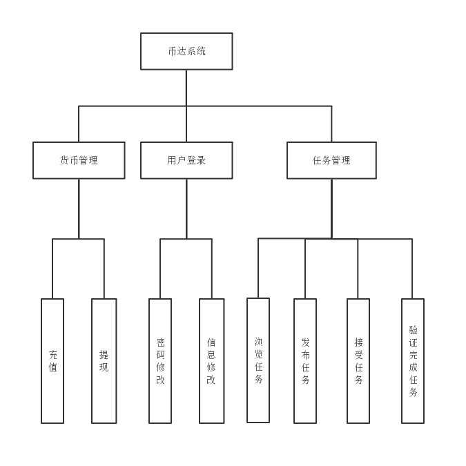
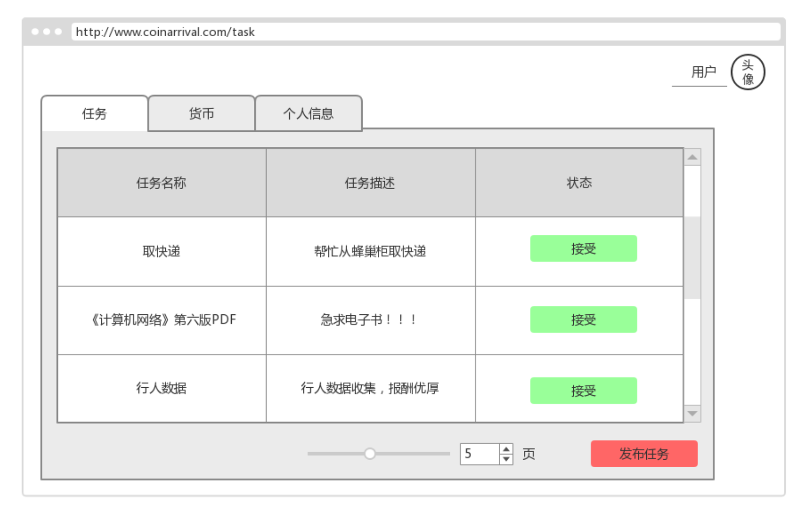
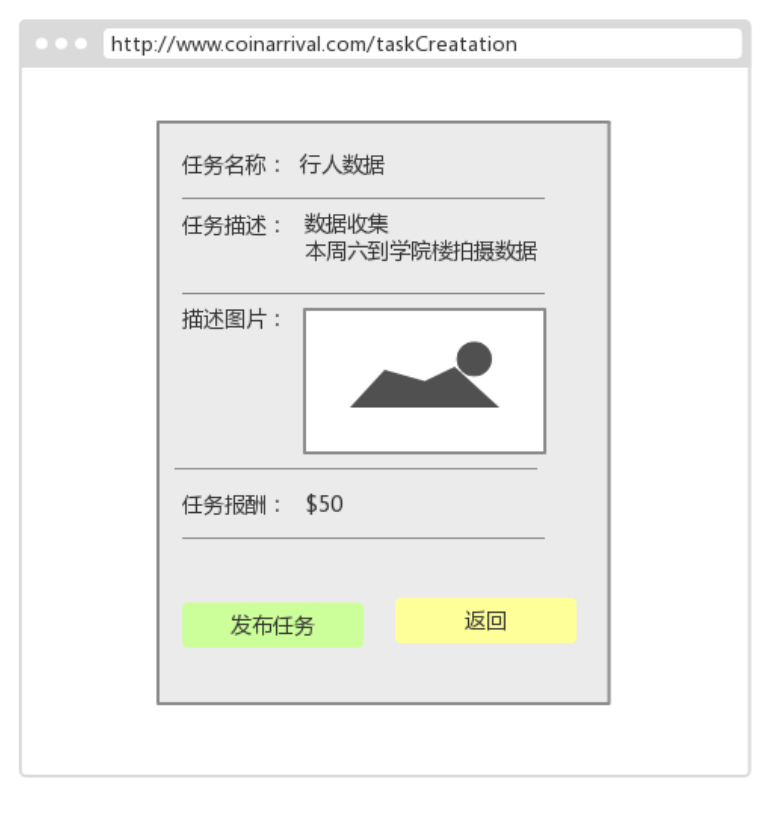

# SRS

**需求规格说明文档**

------------

|版本|日期|描述|作者|
|-|-|-|-|
|v0.1|2019年6月14日|初稿|BroInBro|
|v0.2|2019年6月26日|补充需求分析链接|BroInBro|

## 1. 引言

### 1.1 目的
　　
为明确软件需求、规划项目、确认进度、组织软件开发和测试而撰写本文档。同时，详细分析项目总体需求，可以为软件开发工作打下基础并且明确测试和验收的标准。

### 1.2 背景

本次待开发的软件为**币达**，由 coinArrival 团队开发。

### 1.3 参考资料

1、邹欣.构建之法[M].第三版.人民邮电出版社,2017

## 2. 项目概述

### 2.1 产品描述
　　
我们团队的项目**币达**，是一个众包任务发布/接收/验收平台，旨在帮助校园内的学生，通过空闲时间完成任务赚取闲钱。它基于网页端，允许用户通过手机/PC等多种平台访问网页实现任务的发布、接受、完成和报酬的设置和获取。

### 2.2 产品功能

本产品主要有以下功能，随着版本更新，功能可能会有增删。

1. 发布任务
2. 接受任务
3. 验收任务
4. 用户交易

### 2.3 用户场景
　　
根据需求定义如下典型用户与典型场景：

1. A君 - 普通学生

|名字|A君|
|:--:|:--:|
|性别|女|
|年龄|20|
|身份|大一学生|
|生活情况|成绩一般|
|用户偏好|热心肠，闲不下来|
|典型场景|A君出门后回宿舍时，打开软件，接受取快递或带物品的任务，线下完成获取报酬|

2. B君 - 普通学生

|名字|B君|
|:--:|:--:|
|性别|男|
|年龄|21|
|身份|大二学生|
|生活情况|成绩优异|
|用户偏好|科技宅，IT技术迷|
|典型场景|B君在宿舍打开软件，接受解决电脑问题或搜索电子资料的任务，线上完成任务获取报酬|

3. C君 - 大学老师

|名字|C君|
|:--:|:--:|
|性别|男|
|年龄|35|
|身份|大学老师|
|工作情况|投身学术，正在准备论文|
|用户偏好|关注学术动态|
|典型场景|论文实验需要大量用户数据，在平台上发布任务后，其他用户接受任务，解决需求|

### 2.4 一般约束

#### 2.4.1 开发环境约束

- 开发工具

  VSCode，Travis CI，CoverAlls，Git，Spyder，Mocha，Chai，Swagger Editor

- 开发语言

  HTML5+CSS3+JavaScript，Python

- 开发测试浏览器

  Google Chrome

#### 2.4.2 时间约束

开发周期短，两个月的开发时间需要开发者合理规划时间和安排工作交接。

#### 2.4.3 技术约束

团队成员对各自负责方向的相关技术缺乏深入了解，水平存在一定欠缺，同时缺乏项目经验，需要在开发中并发学习多种技术和能力。

#### 2.4.4 其它约束

开发期间，团队成员还有别的学习任务，对项目进度造成一定程度上的影响。

### 2.5 假设与依据

本项目是否能够成功实施，主要取决于以下的条件：

- 团队成员的积极合作配合，为了项目的开发和实施，对个人时间进行合理规划，同时为团队做出合理牺牲，配合队友完成任务
- 开发过程中遇到的技术问题可以自行解决或得到队友/老师的指导和帮助

## 3. 具体需求

更具体的需求分析，见同目录下的[用例](./usecase.md)/[活动图](./activity.md)/[领域图](./domain.md)/[状态图](./state.md)/[时序图](./sequence.md)

### 3.1 功能图
 　　

### 3.2 功能需求

- 登陆页面

  用户可以登陆账号前往主页面，或通过注册按钮前往注册页面
  

- 注册页面

  用户可以注册账号，或通过登录按钮前往登陆页面
  

- 任务列表页(主页面)
  
  用户可以查看系统上的任务，并通过选择页数浏览不同页的任务。点击任务可以前往任务详情页面；点击接受按钮可以接受任务；点击发布任务按钮可以前往发布任务页面；点击货币按钮可以前往货币页面；点击个人信息按钮，可以前往个人信息页面
  

- 任务详情页

  用户可以查看任务的详细描述。点击接受按钮可以接受任务；点击返回按钮可以返回主页面
  

- 任务发布页面

  用户可以通过填写任务详情来发布任务。点击发布任务可以发布任务；点击返回按钮可以返回主页面
  

- 任务完成页面

  任务发布者可以确认任务完成。点击确认完成按钮，任务完成，接收者可以收到报酬，发布者减去相应货币；点击返回按钮，返回主页面
  

- 个人信息页面

  用户可以修改个人信息，包括头像，密码，邮箱，电话，性别，专业，学号，姓名。点击修改按钮可以修改个人信息；点击货币按钮可以前往货币页面；点击任务按钮，可以前往主页面
  

- 货币页面

  用户可以查看当前账号余额。点击充值按钮可以充值货币；点击提现按钮可以提现货币；点击任务按钮可以前往主页面；点击个人信息按钮，可以前往个人信息页面
  

### 3.3 外部接口需求

#### 3.3.1 用户接口

无特殊需求。

#### 3.3.2 硬件接口

电脑系统可以运行 Google Chrome　　

#### 3.3.3 软件接口

无特殊需求。

#### 3.3.4 通信接口

可以连接互联网

### 3.4 属性

#### 3.4.1 可用性

- 界面简洁美观，操作简单
- 系统稳定，无bug
- 涉及钱币交易时，会有相关提醒

#### 3.4.2 安全性

数据备份，防止用户丢失数据，及时恢复数据

#### 3.4.3 可维护性

- 使用 Github 进行源码管理，便于维护与修复
- 使用 Travis CI 进行持续集成，保证每轮迭代前代码可正确运行
- 使用 CoverAlls 进行测试覆盖率统计，保证代码正确运行的可信度
- 使用 Docker 进行部署安装，避免环境配置问题

## 4. 验证验收表标准

### 4.1 文档验收标准

文档编写无二义性，描述准确

### 4.2 软件验收标准

软件功能正常，运行流畅、不卡顿、不闪退。

### 4.3 界面验收标准

|序号|界面名称|界面描述|
|:--:|-----|-----|
|1|登陆页面|页面中间包含一个交互区域，顶部为 Tab 切换栏，包含登陆和注册两个 Tab。此时选中登陆 Tab。Tab 栏下面是输入区域，包括用户名和密码两个输入框及其标注。输入区域下面是登陆按钮与忘记密码按钮。|
|2|注册页面|页面中间包含一个交互区域，顶部为 Tab 切换栏，包含登陆和注册两个 Tab。此时选中注册 Tab。Tab 栏下面是输入区域，包括用户名，密码，确认密码和电话，共四个输入框及其标注。输入区域下面是注册按钮。|
|3|任务列表页(主页面)|页面右上角显示登陆用户头像和登陆用户名。页面中间顶部为 Tab 切换栏，包含任务，货币和个人信息三个 Tab。此时选中任务 Tab。Tab 栏下面是一个表格，展示任务列表。表格包含三列，第一列为任务名称，第二列为任务描述，第三列为操作区域。操作区域内为接受按钮。表格区域下方为页数选择区域和一个发布任务按钮。|
|4|任务详情页|页面中间包含一个展示区域，包含任务名称，任务描述，描述图片，任务报酬信息。展示区域下方为操作按钮：接受按钮和返回按钮。|
|5|任务发布页面|页面中间包含一个交互区域，包含任务名称，任务描述，描述图片，任务报酬信息共四个输入框。交互区域下方为操作按钮：发布按钮和返回按钮。|
|6|任务完成页面|页面中间包含一个展示区域，包含任务名称，任务描述，描述图片，任务报酬信息。展示区域下方为操作按钮：确认完成按钮和返回按钮。|
|7|个人信息页面|页面右上角显示登陆用户头像和登陆用户名。页面中间顶部为 Tab 切换栏，包含任务，货币和个人信息三个 Tab。此时选中任务 Tab。Tab 栏下面是一个交互区域，包含密码，邮箱，电话，性别，学号，专业和姓名共7个输入信息框。交互区域下方为修改按钮|
|8|货币页面|页面右上角显示登陆用户头像和登陆用户名。页面中间顶部为 Tab 切换栏，包含任务，货币和个人信息三个 Tab。此时选中任务 Tab。Tab 栏下面是一个展示区域，包含余额信息。展示区域下方为操作按钮：充值按钮和提现按钮。
