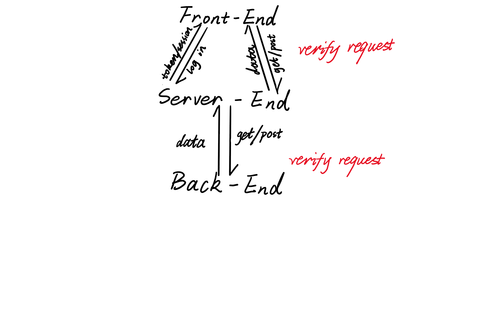

# App Flow

- Other Language Translations

  [中文](./translate/appFlow.md)

## Application Flow Management

- **Front-End retrieves data from Server-End**
  
  It needs provide token/session to help Server-End verify its authorization.
  Once its request is legal, Server-End retrieves data from Back-End.

- **Server-End retrieves data from Back-End**
  
  Back-End needs to verify the request if it comes from the trust machine.
  Once it matches, Back-End sends back data to Server-End and Server-End sends back data to Front-End.